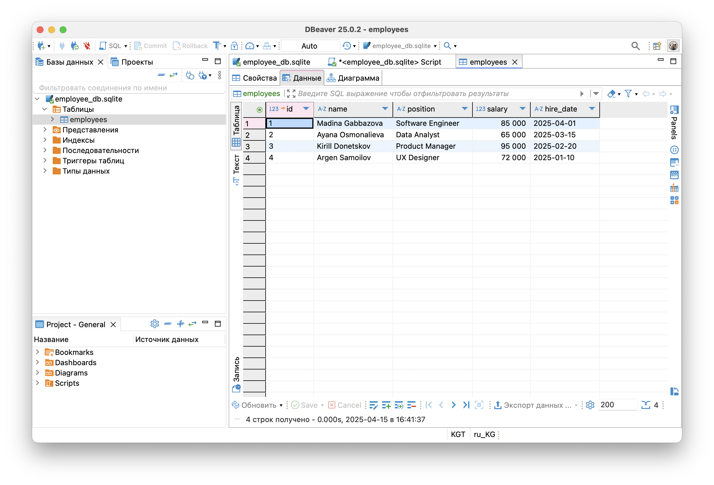
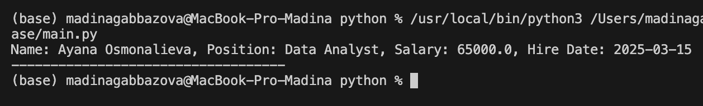
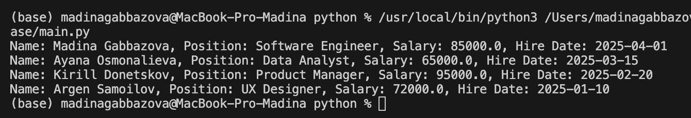
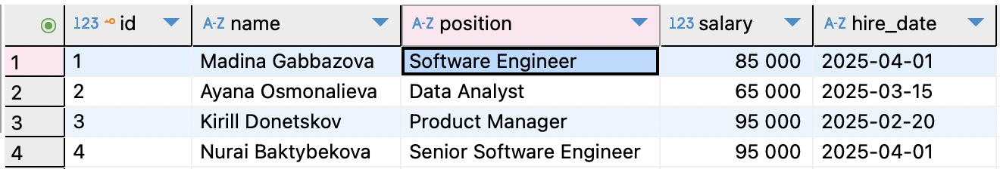
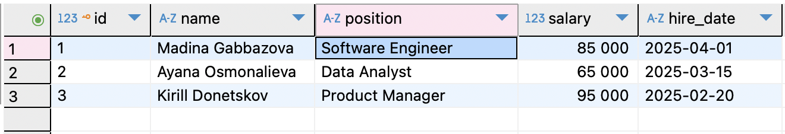

# Employee Database

This repository contains a Python-based application for managing an employee database. It provides functionality to add, update, delete, and retrieve employee records efficiently.

## Features

- Add new employee records.
- Update existing employee details.
- Delete employee records.
- Retrieve employee information.
- Search and filter employees by various criteria.

## Project Structure

- `main.py`: Entry point of the application.
- `employee_db.sqlite`: Database of the repository.
- `employee.py`: Contains `Employee` class.
- `dao.py`: Contains class with methods to make database operations.

## Classes Overview

### `Employee`
Represents an employee in the database.

**Attributes:**
- `name` (str): Full name of the employee.
- `position` (str): Job title of the employee.
- `salary` (float): Employee's salary.
- `hire_date` (str): Employee's hire date.

### `EmployeeDAO`
Manages the collection of employee records.

**Attributes:**
- `db_path` (str): Path to database.

**Methods:**
- `insert(emp: Employee)`: Adds a new employee to the database.
- `get_by_id(semployee_id: int)`: Retrieves an employee by ID.
- `get_all()`: Retrieves all employees.
- `update(employee_id, emp: Employee)`: Updates the employee.
- `delete(employee_id)`: Deletes the employee with the given `employee_id`.

## Test input/output
### Insertion 
#### After this code:
```python
    dao.insert(emp1)
    dao.insert(emp2)
    dao.insert(emp3)
    dao.insert(emp4)
```
#### We get:



### Retrieving by ID
#### After this code:
```python
    print(dao.get_by_id(2))
```
#### We get:



### Retrieving all employees
#### After this code:
```python
    emps = dao.get_all()
    for emp in emps:
        print(emp)
```
#### We get:



### Updating
#### After this code:
```python
    upd_emp = Employee(name="Nurai Baktybekova", position="Senior Software Engineer", salary=95000, hire_date="2025-04-01")
    dao.update(4, upd_emp)
```
#### We get:



### Deleting
#### After this code:
```python
    dao.delete(4)
```
#### We get:


## Installation and usage

1. Clone the repository:
    ```bash
    git clone https://github.com/vinw777/db.git
    ```
2. Navigate to the project directory:
    ```bash
    cd employee_database
    ```
3. Usage:
    ```bash
    python main.py
    ```